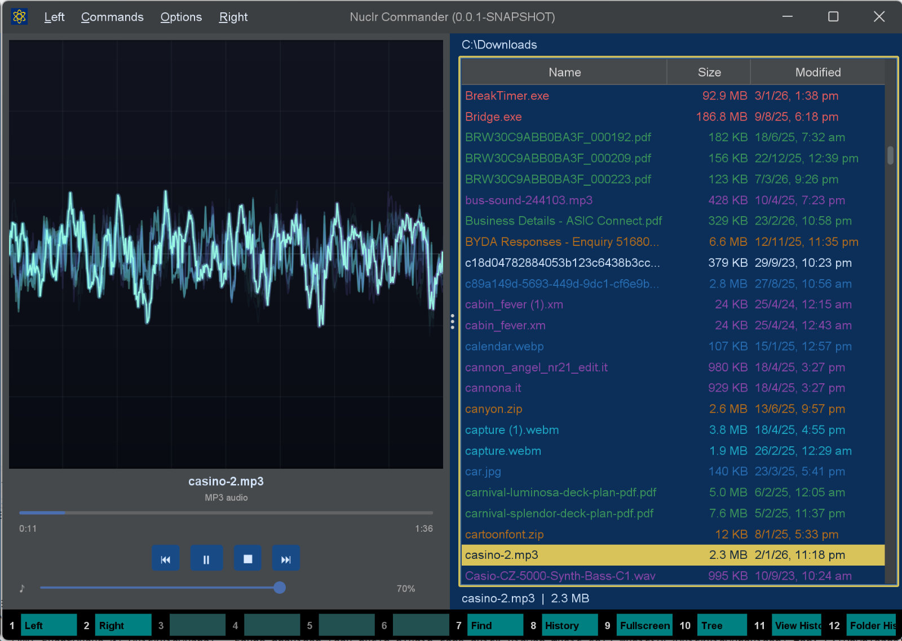
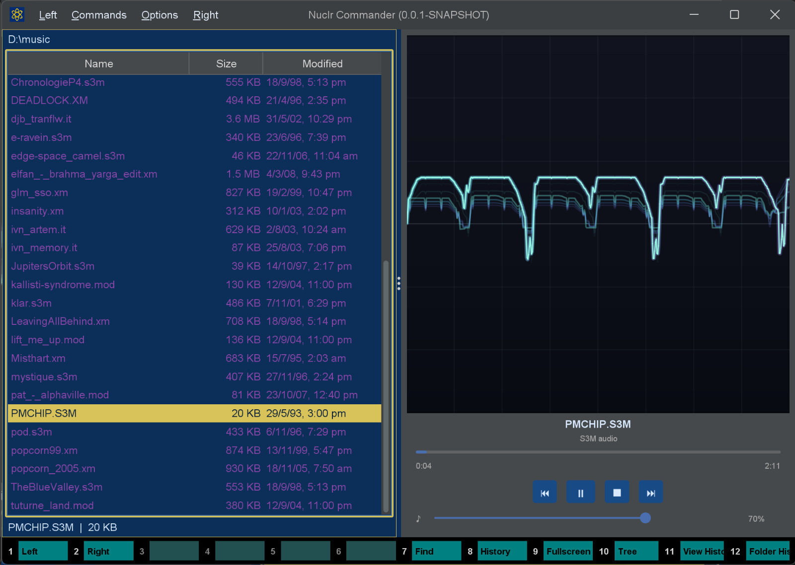

# 🎵🐢 Music Quick Viewer (SDL2)

A rich audio quick viewer plugin for **Nuclr Commander**. It opens music files directly inside the quick view panel, plays them through **SDL2 / SDL2_mixer**, and renders a live waveform so tracker modules feel as lively as they sound. 🎛️🐢

## ✨ What It Does

- 🎵 Plays music and audio files from Nuclr's quick view panel
- 🎛️ Supports tracker formats: `xm`, `mod`, `s3m`, `it`, `669`
- 🔊 Supports common audio formats: `mp3`, `ogg`, `flac`, `wav`, `aac`, `aiff`, `voc`, `mid`
- 📈 Live oscilloscope-style waveform visualizer driven from the SDL post-mix audio callback
- ▶️ Play/pause, stop, seek, rewind (−10 s), and forward (+10 s) controls
- 🎚️ Progress bar with seeking
- ⏱️ Current time and total duration display (when SDL_mixer exposes them)

## 🖼️ Screenshots

### Main Player View



### Quick View In Action



## 🎚️ Player Controls

| Control | Action |
|---|---|
| `⏮` | Jump back 10 seconds |
| `▶` / `⏸` | Toggle play / pause |
| `■` | Stop playback |
| `⏭` | Jump forward 10 seconds |
| Progress bar | Click or drag to seek |

## 🧩 Supported Extensions

| Category | Extensions |
|---|---|
| 🎼 Tracker modules | `xm`, `mod`, `s3m`, `it`, `669` |
| 🔊 Common audio | `mp3`, `ogg`, `flac`, `wav`, `aac`, `aiff`, `voc`, `mid` |

## 🖥️ Runtime Requirements

This plugin depends on **SDL2** and **SDL2_mixer**.

### Windows 🪟

Windows native libraries are bundled with the plugin and extracted automatically at runtime. No extra installation needed.

### macOS 🍎

```bash
brew install sdl2 sdl2_mixer
```

The plugin auto-detects standard Homebrew library locations (`/opt/homebrew/lib`, `/usr/local/lib`, `/opt/local/lib`). For a custom location, launch the JVM with:

```bash
-Djna.library.path=/path/to/libs
```

### Linux 🐧

```bash
sudo apt-get install libsdl2-2.0-0 libsdl2-mixer-2.0-0
```

For a custom location:

```bash
-Djna.library.path=/path/to/libs
```

## 📥 Installation

Copy the signed plugin archive and detached signature into the Nuclr Commander `plugins/` directory:

```text
quick-view-sdl2-music-<version>.zip
quick-view-sdl2-music-<version>.zip.sig
```

Nuclr Commander verifies the RSA-SHA256 signature against `nuclr-cert.pem` on load. The plugin becomes available immediately without a restart.

## ⚙️ How it works

`MusicSDL2QuickViewPlugin` initialises SDL2 and SDL2_mixer via JNA bindings. On Windows, `NativeLibExtractor` unpacks the bundled `.dll` files to a temp directory before the JNA load. The audio post-mix callback feeds decoded PCM samples into `AudioRingBuffer`, which `WaveformPanel` reads to render the oscilloscope display. Loading and SDL initialisation run on a virtual thread so the Swing EDT stays responsive.

## 🗂️ Source Layout

```text
src/main/java/
├── dev/nuclr/plugin/core/quick/viewer/music/sdl2/
│   ├── MusicSDL2QuickViewPlugin.java   plugin entry point
│   ├── MusicSDl2ViewPanel.java         player UI panel
│   └── WaveformPanel.java              oscilloscope waveform renderer
└── sdl2/
    ├── SDLMixerAudio.java              SDL2_mixer JNA bindings
    ├── AudioRingBuffer.java            lock-free ring buffer for PCM samples
    ├── NativeLibExtractor.java         Windows native library extractor
    └── SDLDiagnostic.java              SDL environment diagnostics
```

## 📚 Dependencies

| Library | Version | Purpose |
|---|---|---|
| `dev.nuclr:platform-sdk` | `3.0.1` | Nuclr platform interfaces |
| `jna` | `5.18.1` | Native SDL2 / SDL2_mixer bindings |

## 🌐 Links

- Website: <https://nuclr.dev>
- Plugin page: <https://nuclr.dev/plugins/core/music-sdl2-quick-viewer.html>

## 📄 License

Apache-2.0. SDL-related runtime notices are included in the repository where required.
